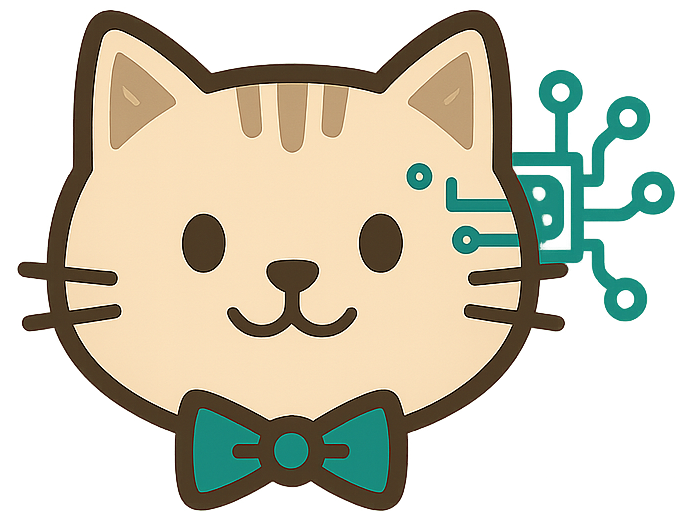

# 🐱 CatButler - Seu Assistente Doméstico IA

<div align="center">
  
  
  [](https://reactjs.org/)
  [](https://vitejs.dev/)
  [](https://tailwindcss.com/)
  [](https://threejs.org/)
  [](LICENSE)
</div>

## 📋 Sobre o Projeto

O **CatButler** é uma aplicação web moderna que utiliza inteligência artificial para ajudar na organização doméstica. Com foco em receitas, faxina e compras, oferece uma experiência fluida e intuitiva para gerenciar tarefas do dia a dia.

### ✨ Principais Funcionalidades

- 🍳 **Cozinha IA**: Sugestões de receitas baseadas nos ingredientes disponíveis
- 🧹 **Faxina IA**: Rotinas de limpeza personalizadas e realistas
- 🛒 **Mercado IA**: Comparação de preços por localidade
- 📅 **Plano Semanal**: Organização de tarefas e sugestões automáticas
- 🔥 **Descobertas do Dia**: Dicas personalizadas e novidades
- 👨‍👩‍👧‍👦 **Conta Familiar**: Compartilhamento de receitas e listas
- ⚙️ **Configurações**: Personalização completa da experiência

## 🚀 Tecnologias Utilizadas

### Frontend
- **React 19.1.1** - Biblioteca principal para interface
- **Vite 7.1.4** - Build tool e servidor de desenvolvimento
- **Tailwind CSS 3.4.0** - Framework CSS utilitário
- **React Router DOM 7.8.2** - Roteamento de páginas
- **React Icons 5.5.0** - Ícones SVG

### 3D e Visualizações
- **Three.js 0.180.0** - Biblioteca 3D
- **React Three Fiber 9.3.0** - React renderer para Three.js
- **React Three Drei 10.7.4** - Helpers e abstrações

### Utilitários
- **React Responsive 10.0.1** - Responsividade
- **React Spring 10.0.1** - Animações

## 📦 Instalação

### Pré-requisitos
- Node.js 18+ 
- npm ou yarn

### Passos para Instalação

1. **Clone o repositório**
```bash
git clone https://github.com/seu-usuario/catbutler-react.git
cd catbutler-react
```

2. **Instale as dependências**
```bash
npm install
# ou
yarn install
```

3. **Execute o projeto**
```bash
npm run dev
# ou
yarn dev
```

4. **Acesse no navegador**
```
http://localhost:5173
```

## 🏗️ Estrutura do Projeto

```
catbutler-react/
├── public/                     # Arquivos estáticos
│   ├── favicon-*.png          # Favicons em diferentes tamanhos
│   └── js/                    # Scripts externos
├── src/
│   ├── assets/                # Recursos estáticos
│   │   └── images/           # Imagens do projeto
│   ├── components/            # Componentes reutilizáveis
│   │   ├── CustomBackground.jsx
│   │   ├── Footer.jsx
│   │   └── Header.jsx
│   ├── contexts/              # Contextos React
│   │   └── ThemeContext.jsx
│   ├── pages/                 # Páginas da aplicação
│   │   ├── Home.jsx
│   │   ├── Config.jsx
│   │   ├── CozinhaIA.jsx
│   │   ├── FaxinaIA.jsx
│   │   ├── MercadoIA.jsx
│   │   └── ...
│   ├── App.jsx               # Componente principal
│   ├── main.jsx              # Ponto de entrada
│   ├── routes.jsx            # Configuração de rotas
│   └── index.css             # Estilos globais
├── package.json
├── tailwind.config.js
├── vite.config.js
└── README.md
```

## 🎨 Design System

### Cores Principais
- **Verde**: `#22c55e` (Ações principais)
- **Azul**: `#3b82f6` (Informações)
- **Roxo**: `#7c3aed` (Destaques)
- **Laranja**: `#f97316` (Avisos)
- **Midnight**: `#191970` (Texto escuro)

### Componentes
- **Glass Effect**: Fundo translúcido com blur
- **Botões**: Cores vibrantes com hover effects
- **Cards**: Bordas arredondadas e sombras suaves
- **Tabs**: Navegação intuitiva entre seções

## 🔧 Scripts Disponíveis

```bash
# Desenvolvimento
npm run dev

# Build para produção
npm run build

# Preview do build
npm run preview

# Linting
npm run lint
```

## 🌙 Modo Claro/Escuro

O projeto suporta alternância automática entre modos claro e escuro:
- **Detecção automática** baseada na preferência do sistema
- **Toggle manual** no header
- **Persistência** das configurações
- **Transições suaves** entre os modos

## 📱 Responsividade

- **Mobile First**: Design otimizado para dispositivos móveis
- **Breakpoints**: sm, md, lg, xl, 2xl
- **Grid System**: Layout flexível e adaptável
- **Touch Friendly**: Botões e elementos otimizados para toque

## 🚀 Deploy

### Vercel (Recomendado)
```bash
npm install -g vercel
vercel --prod
```

### Netlify
```bash
npm run build
# Upload da pasta dist/ para Netlify
```

### GitHub Pages
```bash
npm run build
# Configure GitHub Actions para deploy automático
```

## 🤝 Contribuição

1. Fork o projeto
2. Crie uma branch para sua feature (`git checkout -b feature/AmazingFeature`)
3. Commit suas mudanças (`git commit -m 'Add some AmazingFeature'`)
4. Push para a branch (`git push origin feature/AmazingFeature`)
5. Abra um Pull Request

## 📄 Licença

Este projeto está sob a licença MIT. Veja o arquivo [LICENSE](LICENSE) para mais detalhes.

## 👨‍💻 Autor

**Izadora**
- GitHub: [@ipierette](https://github.com/ipierette)
- LinkedIn: [Izadora](https://www.linkedin.com/in/izadora)
- Website: [CatBytes](https://catbytes.netlify.app)

## 🙏 Agradecimentos

- Comunidade React
- Equipe do Vite
- Desenvolvedores do Tailwind CSS
- Comunidade Three.js

---

<div align="center">
  <p>Feito com ❤️ e ☕ por Izadora</p>
  <p>🐱 CatButler - Organize sua casa com IA</p>
</div>